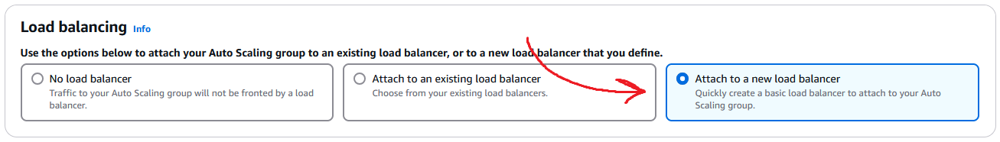

# Auto Scaling Groups and Load Balancing

## Overview

## How to Create an Auto Scaling Group (ASG)

### 1. Navigate to Auto Scaling Groups
From the **EC2 dashboard**, go to **Auto Scaling Groups**  

### 2. Create a New ASG  
Click **Create Auto Scaling group**  

### 3. Configure Basic Settings
- **Name:** Use a descriptive name (e.g. name-app-asg)
- **Launch Template:** Select an existing one or [create one](#how-to-create-a-launch-template)  

### 4. Configure Network
- **Availability Zones/Subnets:** Select zones (e.g. DevOpsStudent default 1a–1c)
- **Distribution:** Choose **Balanced best effort**  

### 5. Attach to a Load Balancer
- Select **Attach to a new load balancer**  

- **Load Balancer Type:** Application Load Balancer (HTTP/HTTPS)
- **Name:** e.g. name-app-asg-lb
- **Scheme:** Internet-facing
- Ensure subnets/availability zones match previous selections
- **Target Group:** Create a new one and name it (e.g., name-app-asg-lb-tg)  

- **VPC Lattice Integration:** Select **No VPC Lattice service**
- **Health Checks:** Enable **Elastic Load Balancing health checks**  

### 6. Configure Scaling Policies
- **Desired Capacity**  

- **Minimum/Maximum Capacity**
- **Policy Type:** Select **Target tracking scaling policy**
- **Name:** Use a descriptive name
- **Metric Type:** Choose a CloudWatch metric  

### 7. Additional Configurations
- **Instance Maintenance Policy:** Select **No policy**
- **Additional Capacity Settings:** Leave as **Default**
- **Additional Settings:** Leave all boxes unticked
- **Notifications:** Skip, click **Next**
- **Tags:** Add a tag  
  - **Key:** Name  
  - **Value:** e.g. name-app-asg  

### 8. Review and Create
- Review all configurations
- Click **Create Auto Scaling group**

---

## How to Delete an Auto Scaling Group (ASG)

> Important: Deleting the instance first will cause the ASG to recreate it. Follow this order:

### 1. Delete the Load Balancer (LB)
- Go to **Load Balancers** from EC2 dashboard  
  

- Select LB > **Actions** > **Delete Load Balancer**  
  

- Type **confirm** in the prompt to confirm deletion

### 2. Delete the Target Group (TG)
- Go to **Target Groups** from EC2 dashboard  
  

- Select TG > **Actions** > **Delete**  
  

- Confirm by clicking **Yes, delete**

### 3. Delete the ASG
- Go to **Auto Scaling Groups**  
  

- Select ASG > **Actions** > **Delete**  
  

- Type **delete** to confirm

---

## How to Create a Launch Template

### 1. Navigate to Launch Templates
From the EC2 dashboard, go to **Launch Templates**  

### 2. Create a New Template
Click **Create launch template**  

### 3. Configure Launch Template
- **Name:** e.g. name-app-lt
- **Description:** Add a meaningful description
- Tick **Auto Scaling guidance**  

### 4. Application and OS Images (Amazon Machine Images - AMI)
- Select **My AMIs**
- Tick **Owned by me**
- Choose the appropriate AMI  

### 5. Configure Instance Details
- **Instance Type:** t2.micro
- **Key Pair:** Select your existing key
- **Network Settings:**  
  - Select existing security group
  - Ensure it allows port **22** and **80**

- **User Data Script:** Add the script for app deployment
- **Resource Tags:**  
  - Key: Name  
  - Value: desired instance name
