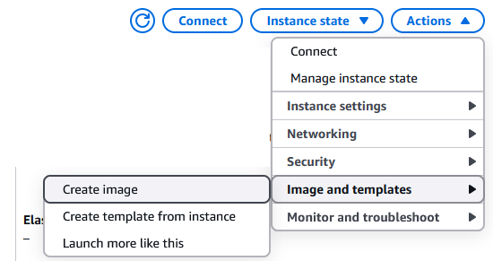
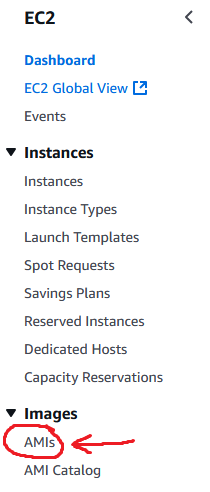
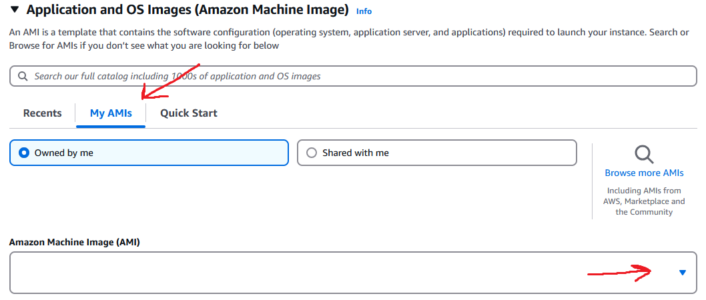

# Images

## What are Images?

An Image is a pre-packaged, read-only template that contains everything needed to run an application, including:
- Code
- Dependencies (libraries, runtimes)
- Environment settings
- Configurations

It acts as a blueprint for creating instances of that environment, whether it is a lightweight application such as a container (e.g. Docker) or a full computer such as a virtual machine (e.g. AMI in AWS).

## How do Images work?

When an image is run, the system follows a structured process to bring it to life.

Think of a virtual machine (VM) image as a snapshot of a computer, including its operating system and software. When you run it:

1. The system creates a new virtual machine based on the image.
2. A virtual hard drive is set up using cloud storage (like Amazon EBS).
3. The machine boots up, just like a physical computer, loading the operating system.
4. Startup scripts and settings are applied, configuring the network and security.
5. The machine is now running, and users can log in and use it.

## Why are Images helpful for a business?

- **Consistency & Reliability**
    - Eliminates problems where it may work on one machine but not another - ensure applications run the same way in development, testing, and production environments
    - Standardised deployments - reduces configuration drift and human errors
- **Faster Deployment**
    - Pre-packaged environments - images contain everything needed to run an application, removing the need for manual setup
    - Instant scaling - can quickly spin up new instances from images to handle increased traffic
- **Cost Efficiency**
    - Optimised resource usage - images are lightweight compared to full virtual machines, reducing server costs
    - Pay-as-you-go models - businesses can run only the instances they need, reducing waste
- **Security & Compliance**
    - Immutable & secure - images are read-only, they reduce the risk of unauthorised changes or configuration drift
    - Version control - can track and roll back to previous image versions if needed
- **Collaboration & Automation**
    - DevOps-friendly - enables smooth CI/CD pipelines, making automations and continuous deployment easy
    - Improved collaboration - teams can share and use the same images, ensuring consistency in development and testing

### Summary
- **Reduce downtime** by making deployments fast and predictable
- **Lower costs** by optimising infrastructure and scaling efficiently
- **Improve security** by using immutable, controlled environments
- **Enable automation** for faster software delivery

---

## Guide to Creating an Image for an AWS Instance

### Step 1: Prepare the Instance
1. **Update and Upgrade Software:** Ensure all software packages are up to date.
2. **Clean Unnecessary Files:** Remove temporary files and unnecessary logs to keep the image size minimal.
3. **Stop Unused Services:** Disable any services that are not needed in the image.
4. **Ensure Security Measures:** Remove sensitive data and ensure no credentials are left on the instance.

### Step 2: Create the AMI
1. **Log in to AWS Management Console** and go to the **EC2 Dashboard**.
2. **Select the Instance** you want to create an image from - make sure it is stopped.
3. Click **Actions** > **Image and templates** > **Create image**.

    

4. In the **Create Image** dialog:
   - Provide a **name** and **description** for the image.
   - Select **No reboot** if you don’t want the instance to restart (not recommended for running instances).
   - Configure **storage volume settings** as needed.
5. Click **Create Image**.
6. Navigate to **AMIs** under the EC2 Dashboard to monitor the image creation process.

    

---

## Guide to Using an Image for an AWS Instance

### Step 1: Launch an Instance from an AMI
1. Go to the **AWS Management Console** and open the **EC2 Dashboard**.
2. Click **Launch Instance**.
3. Select the **My AMIs** tab and choose the AMI you created.

    

4. Configure the instance details, including:
   - Instance type
   - Key pair for SSH access
   - Security group settings
   - Storage volume configuration
5. Click **Launch** and monitor the instance startup process.

### Step 2: Connect to the Instance
1. Once the instance is running, go to **EC2 Dashboard** > **Instances**.
2. Select the newly launched instance.
3. Click **Connect** and choose the appropriate method (SSH, Session Manager, RDP, etc.).
4. Verify that the instance is functional and that all configurations from the AMI are correctly applied.
