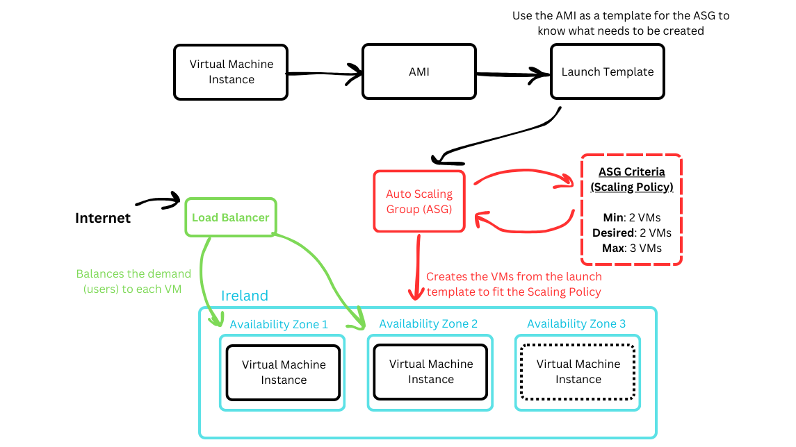

# Monitoring and Alerts

Amazon CloudWatch allows you to monitor AWS resources and applications in real-time. By setting up a CloudWatch dashboard for an EC2 instance, you can track performance metrics and gain insights into resource utilisation.

## Prerequisites

- An AWS account
- An EC2 instance running in your AWS environment
- Permissions to create CloudWatch dashboards and alarms

## Setting up a Dashboard in Cloudwatch

### 1. Navigate to the EC2 Instance Details Page
1. Log in to the [AWS Management Console](https://aws.amazon.com/console/).
2. Go to **EC2** by searching for it in the AWS services search bar.
3. In the **Instances** section, locate and click on the EC2 instance you want to monitor.
4. In the **Instance details** page, scroll down to the **Monitoring** section.

    

### 2. Create a CloudWatch Dashboard
1. Click **Manage detailed monitoring**.

    

2. Enable the Detailed monitoring by **ticking the Enable tickbox**

    

1. Click **Create new** in the pop-up window in the new tab that opens.
2. Type in a **name for your dashboard**.
3. Click **Create**.
4. Click **Add to dashboard** in the bottom right

    

### 4. Customise the Dashboard
- Rearrange widgets by dragging and resizing them.
- Rename widgets for better organisation.
- Add multiple metrics to a single widget for correlation.

### 5. Save and View the Dashboard
- Click **Save dashboard** to retain your changes.
- Navigate to **CloudWatch > Dashboards** anytime to monitor your EC2 instance metrics.

## Setting Up Alarms for Key Metrics
To receive notifications when certain thresholds are exceeded:

1. In the **EC2 Instance Details Page**, go to the **Status and alarms** tab.
2. Click **Actions > Create status check alarm**.
3. Select **Create an alarm** in Add or edit alarm section.
4. Type in a **name** for the Alarm notification and **Create an SNS Topic**

    

5. Configure notification actions (e.g. send an email via SNS).
6. Set the Alarm threshold conditions (e.g. CPU Utilization > 80% for 1 minute).

    

7. Click **Create** in the bottom-right of the page.

## Auto-Scaling Groups (ASG) and Load Balancing (LB)

