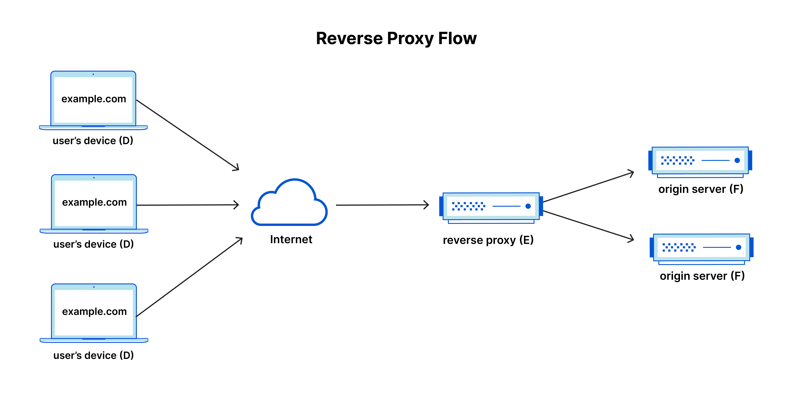
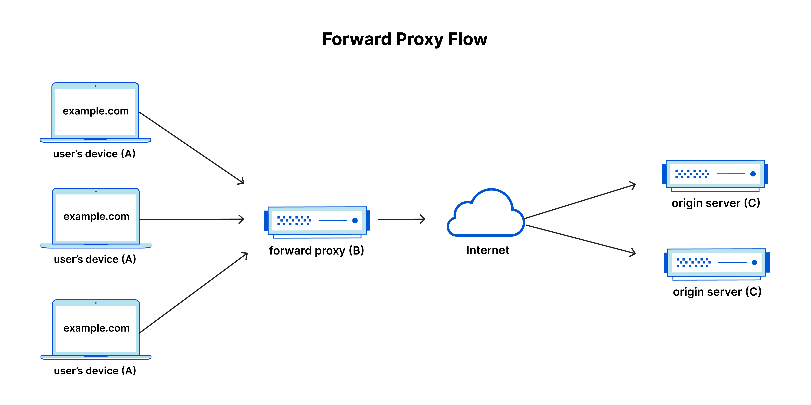

# Reverse Proxy Notes

## What is a Reverse Proxy?

A **reverse proxy** is a server that sits between client devices (e.g., web browsers) and a web server. It acts as an intermediary, handling requests from clients and forwarding them to the appropriate backend server.

---

## Why Implement a Reverse Proxy?

### 1. **Security**
   - **Protection of Backend Servers:** A reverse proxy hides the identity and structure of backend servers, making it harder for attackers to directly access them.
   - **DDoS Mitigation:** It can protect against Distributed Denial of Service (DDoS) attacks by filtering malicious traffic before it reaches the backend servers.

### 2. **Scalability and Flexibility**
   - **Hide Backend Infrastructure:** Clients only see the reverse proxy's IP address, allowing changes to be made to the backend infrastructure without exposing it to the client.
   - **Load Balancing:** In environments with fluctuating traffic, the reverse proxy can distribute client requests across multiple backend servers, helping to scale server capacity up or down.

### 3. **Performance**
   - **Response Time Optimization:** It reduces the time taken to generate a response and return it to the client through techniques like caching and SSL termination.
   - **Load Balancing:** A reverse proxy can distribute client requests across multiple servers, ensuring no single server is overwhelmed by traffic.

---

## How is a Reverse Proxy Different from a Forward Proxy?

- **Reverse Proxy:** Acts on behalf of the server. It sits in front of the origin server, ensuring that no client directly communicates with it.
- **Forward Proxy:** Acts on behalf of the client. It sits in front of the client, ensuring that no origin server directly communicates with that client.

---

## How Do Reverse Proxies Work?

In a typical setup, all requests from the user's device (D) go directly to the origin server (F), and responses come back directly (F -> D). With a reverse proxy, however, the requests go to the reverse proxy (D -> E) first, and then the reverse proxy forwards them to the origin server (E -> F). The reverse proxy acts as a middleman between the client and the server, handling requests and responses.

### Reverse Proxy Flow:
  
*[Reference](https://www.cloudflare.com/en-gb/learning/cdn/glossary/reverse-proxy/)*

---

## Compared to Forward Proxy

In contrast, with a forward proxy, the flow is different. The client’s requests go through the forward proxy (A -> B), which then forwards the request to the origin server (B -> C). The responses flow back through the proxy (C -> B -> A).

### Forward Proxy Flow:


---

## How to Implement a Reverse Proxy

### Manually

1. **Launch the instance**
   - On the hosting site (AWS), launch the instance with your set configuration (e.g., name, compute power, security protocol, SSH key).
   - Copy the command to connect to the instance.

2. **Connect to the instance**
   - Launch Git Bash.
   - Navigate to the `.ssh` directory:
     ```bash
     cd ~
     cd .ssh
     ```
   - Connect to the instance by pasting the connection command into the terminal and typing `yes` to the prompt to add the IP address to your known hosts folder.

3. **Install the dependencies**
   - Update the package list:
     ```bash
     sudo apt update -y
     ```
   - *OPTIONAL*: Stop the outdated daemon that brings up an interface:
     ```bash
     sudo systemctl stop packagekit
     ```
   - Upgrade the installed packages:
     ```bash
     sudo apt upgrade -y
     ```
   - Install NGINX:
     ```bash
     sudo apt install nginx -y
     ```

4. **Edit the configuration**
   - Open the NGINX configuration file:
     ```bash
     nano /etc/nginx/sites-available/default
     ```
   - Find the `location` part of the configuration file.
   - Add the following line:
     ```nginx
     proxy_pass http://localhost:3000;
     ```
   - Save and exit the file:
     - Press `CTRL + X`
     - Press `Y`
     - Press `Enter`

5. **Re-launch the dependency**
   - Restart NGINX:
     ```bash
     sudo systemctl restart nginx
     ```

6. **Deploy the app**
   - Navigate to the repository:
     ```bash
     cd app
     ```
   - Install the dependencies:
     ```bash
     sudo npm install
     ```
   - *OPTIONAL*: Install a package manager for node processes:
     ```bash
     sudo npm install pm2 -g
     ```
   - Run the app:
     - *OPTIONAL*: Kill any processes that may interfere:
       ```bash
       pm2 kill
       ```
     - Run the app in the background:
       ```bash
       node app.js &   # or
       pm2 start app.js &
       ```

### Automated

1. **Launch the instance**
   - On the hosting site (AWS), launch the instance with your set configuration (e.g., name, compute power, security protocol, SSH key).
   - Copy the command to connect to the instance.

2. **Connect to the instance**
   - Launch Git Bash.
   - Navigate to the `.ssh` directory:
     ```bash
     cd ~
     cd .ssh
     ```
   - Connect to the instance by pasting the connection command into the terminal and typing `yes` to the prompt to add the IP address to your known hosts folder.

3. **Create a script to run**
   - Create the script:
     ```bash
     nano script.sh
     ```
   - Paste the following commands into the script file:

     ```bash
     #!/bin/bash

     # update
     sudo apt update -y

     # stop the packagekit daemon error
     sudo systemctl stop packagekit

     # upgrade
     sudo apt upgrade -y

     # install nginx
     sudo apt install nginx -y

     # edit nginx config with reverse proxy settings
     sudo sed -i '51c\       proxy_pass http://localhost:3000;' /etc/nginx/sites-available/default

     # restart nginx
     sudo systemctl restart nginx

     # get app code - cannot use scp (hint: use github and git)!
     git clone https://github.com/username/your-repo.git

     # install nodejs version 20.x
     curl -fsSL https://deb.nodesource.com/setup_20.x | sudo -E bash - &&\sudo apt-get install -y nodejs
     
     # check version
     node -v

     # cd into cloned directory
     cd your-repo

     # cd into app directory
     cd app

     # install dependencies
     sudo npm install

     # install pm2 - process manager package for nodejs apps
     sudo npm install pm2 -g

     # kill any running node processes that could interfere - idempotency
     pm2 kill

     # run the app with pm2 (& = run in background)
     pm2 start app.js &
     ```

4. **Execute the script**
   - Give the script execution permission:
     ```bash
     chmod +x script.sh
     ```
   - Run the script:
     ```bash
     ./script.sh
     ```

